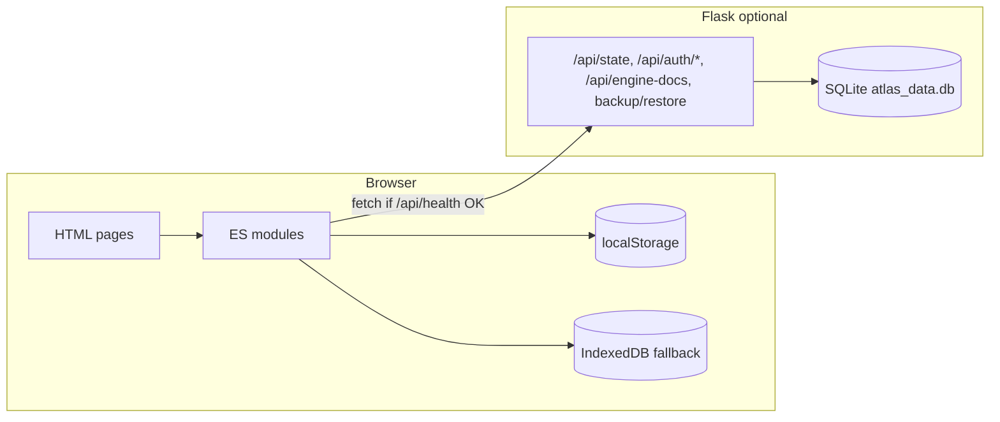

# ATLAS – Digital Twin Engineering Preparation Platform

**Advanced Twin-based Lifecycle and Activity System (PS-ETW)** – Multi-project planning, activity control, delay/risk intelligence, and engineering-readiness workflows. The app is a **multi-page** front end (vanilla ES modules) backed by **Flask + SQLite** when the Python server is running, with a **localStorage / IndexedDB** fallback when served as static files only.

---

## Branch: `cursor/user-interface-improvements-7cd7`

This branch focuses on **organization-grade UI/UX**: sidebar shell, design tokens (`atlas-redesign.css`), login and dashboard polish, **Project Setup** as the **project management hub** (full CRUD) vs a **compact project switcher** on other sheets, **Engine Description** uploads with optional server blob storage, **global search** in the top header, text-based shell controls (shortcuts, theme, alerts, audit), **Audit Log** full page, and related README/documentation updates.

---

## How the application fits together



1. **`stateReady()`** (`storage.js`) probes `/api/health`. If the backend responds, state is loaded with **`GET /api/state`** and saves use **`PUT /api/state`**. Otherwise the same JSON document lives in **localStorage** (with IndexedDB assist from `idb.js` when needed).
2. **`initPage()`** (`page-init.js`) waits for state, runs **`access-shell.js`** (auth + role gates), **`initShell()`** (shortcuts, theme, global search, alerts, audit button, SW registration), and **`initializeProjectToolbar()`** (switcher or full hub).
3. **Per-page scripts** (e.g. `dashboard.js`, `activities.js`) render UI from **`getActiveProject()`** / **`getActivities()`** and subscribe to **`industrial_planning_state_changed`** when the shared state updates.
4. **Audit trail** for change events uses **`logAudit()`** → `audit.js` → **`localStorage` key `atlas_planning_audit_v1`** (cap ~200 entries). The **Audit Log page** reads this; it is separate from SQLite state.

---

## Tech stack

| Layer        | Technology |
|-------------|------------|
| UI          | HTML5, CSS3, **ES modules** (no React/Vue) |
| Design      | `css/styles.css` imports **`css/atlas-redesign.css`** (tokens, sidebar, cards, login split, audit page, dark theme) |
| Typography  | **DM Sans**, **IBM Plex Mono** (via redesign stylesheet) |
| Backend     | Python **Flask**, **SQLite** (`atlas_data.db`) |
| Charts      | **Chart.js** (dashboard, materials, intelligence, etc.) |
| Spreadsheets| **SheetJS (xlsx)** on CDN – Activity import; Engine Description parsing |
| Word        | **Mammoth** on CDN – `.docx` text extraction for Engine Description |
| PWA         | **`sw.js`** service worker; offline cache list in-repo |
| Tests       | **Playwright** – `npm run test:browser` (expects static server, default `http://127.0.0.1:8080`) |

### Cloud agent / “Ports” preview (HTTP 502)

Forwarded URLs (e.g. `*.agent.cvm.dev`) hit the container’s **non-loopback** interface. If you start Python’s static server **without** `--bind 0.0.0.0`, it listens only on `127.0.0.1` and the preview returns **502 / “unable to handle this request”**.

Use:

```bash
PORT=8080 npm run serve:static
# or: bash serve-static.sh
```

Then open **`/login.html`** on the preview URL. For the full Flask API + static files, use **`./start.sh`** (already binds `0.0.0.0:5000`).

---

## Project structure

```
├── app.py                 # Flask: state, auth sessions, backup/restore, engine-docs blobs
├── start.sh               # Optional Codespace / local startup
├── requirements.txt       # flask, flask-cors
├── package.json           # Playwright devDependency
├── atlas_data.db          # Created at runtime (SQLite)
├── sw.js                  # Service worker cache manifest
│
├── index.html             # Executive dashboard
├── login.html
├── project-setup.html     # PS-ETW hub + full project toolbar (mode: full)
├── engine-description.html
├── activities.html
├── calendar.html
├── gantt.html
├── network.html
├── materials.html
├── intelligence.html
├── risk-register.html
├── anomaly-center.html
├── audit-log.html         # Also served as /audit and /audit-log (see Flask routes)
│
├── css/
│   ├── styles.css         # Global rules; @imports atlas-redesign.css first
│   └── atlas-redesign.css # Design system, layout, login, audit, components
│
├── js/
│   ├── page-init.js       # stateReady → auth → shell → project toolbar
│   ├── access-shell.js    # Role gating, session chip, logout
│   ├── auth.js            # Login, roles, permissions, optional API token session
│   ├── storage.js         # Single source of truth: projects, activities, settings, setup, engine docs metadata
│   ├── schema.js          # Column schema, sanitizeActivity, IDs
│   ├── analytics.js       # Metrics, risk, critical path, blocked, delay/risk rows
│   ├── common.js          # escapeHtml, modals, toasts, setActiveNavigation, keyboard help
│   ├── shell.js           # Nav toggle, sidebar tools, wires global search / theme / alerts / audit modal
│   ├── theme.js           # Light/dark toggle
│   ├── global-search.js   # Search slot in top header
│   ├── alerts.js          # Alert dropdown from analytics-derived events
│   ├── shortcuts.js       # Ctrl+/ and activity shortcuts delegation
│   ├── undo.js            # Undo/redo stack for Activity Master
│   ├── audit.js           # logAudit, getAuditLog, Change History modal
│   ├── audit-log.js       # Full Audit Log page
│   ├── project-toolbar.js # mode: "switcher" | "full" (Project Setup only)
│   ├── project-setup.js   # PS-ETW form, team, prefs
│   ├── engine-description.js
│   ├── engine-doc-parse.js
│   ├── dashboard.js
│   ├── activities.js
│   ├── gantt.js
│   ├── calendar.js
│   ├── network.js
│   ├── materials.js
│   ├── intelligence.js
│   ├── risk-register.js
│   ├── anomaly-center.js
│   ├── onboarding.js      # Guided tour (Driver.js-style overlays)
│   ├── login.js
│   ├── comments.js
│   ├── templates.js
│   └── idb.js             # IndexedDB fallback for large state
│
├── scripts/
│   └── apply-sidebar-layout.py   # One-off HTML layout helper (sidebar migration)
│
└── tests/
    ├── run-browser-test.js       # Main Playwright smoke test
    ├── login-flow-test.js
    ├── add-activity-test.js
    ├── quick-demo-test.js
    └── …                         # Diagnostics / headful helpers
```

---

## Data model (application state)

The document stored under SQLite key **`industrial_planning_intelligence_state_v1`** (or localStorage equivalent) is roughly:

| Field | Purpose |
|-------|---------|
| `projects` | Array of projects; each has `id`, `name`, `activities[]`, `baselines[]`, `actions[]`, **`setup`** (PS-ETW fields), **`engineDocuments[]`** (metadata + parse summary; file bytes may live in SQLite via API) |
| `activeProjectId` | Currently selected project |
| `settings` | e.g. column visibility, default editor name |

**Project IDs** follow `PRJ-0001` style; activities use **`ACT-`…** IDs from schema rules. **`logAudit()`** does not mutate this document; it appends to a separate audit list in localStorage.

---

## Run

### With Python backend (recommended)

```bash
pip install -r requirements.txt
python app.py
```

Default port **5000** (`PORT` env overrides). Open the app URL; data persists in **`atlas_data.db`**.

### Static-only (no API)

```bash
python3 -m http.server 8080
```

Use **`http://127.0.0.1:8080/login.html`**. State stays in the browser; auth uses the same demo users from **`auth.js`** (no server sessions).

### Quick demo / dev login

- **Quick Demo (Planner)** on the login page, or  
- Append **`?dev=1`** to a URL to auto-login as planner (development convenience).

---

## Pages and navigation

All authenticated pages share:

- **Left sidebar** (`aside.app-sidebar`): groups **Main**, **Planning**, **Analytics**, **Management** (includes **Anomaly Center** and **Audit Log**).
- **Top bar** (`header.atlas-top-header`): title, optional dashboard filters, **session chip**, and injected **global search** + **alerts** bell.
- **Project strip**: on most pages, **active project** dropdown + summary + **Manage projects** → `project-setup.html`. **Project Setup** uses the **full** toolbar (create, duplicate, rename, delete, import/export JSON, backup/restore when API available).

| Page | File | Highlights |
|------|------|------------|
| Login | `login.html` | Split hero + card; demo users; remember me |
| Dashboard | `index.html` | KPIs, charts, critical path, blocked, risks, alert center, customize KPIs modal |
| Project Setup | `project-setup.html` | PS-ETW metadata, team roster, workspace prefs; **full** project admin |
| Engine Description | `engine-description.html` | Upload/parsed summaries; server blob upload when logged in via API |
| Activity Master | `activities.html` | Grid, import/export, bulk actions, comments, undo |
| Calendar | `calendar.html` | Month view, drag reschedule, density, detail panel |
| Gantt | `gantt.html` | Drag/resize bars, dependencies SVG, filters |
| Network | `network.html` | Dependency graph/list view |
| Materials | `materials.html` | Material KPIs and charts |
| Delay & Risk | `intelligence.html` | Root cause, simulation, risk tables |
| Risk Register | `risk-register.html` | High-risk activity focus |
| Anomaly Center | `anomaly-center.html` | Data quality, baselines, actions |
| Audit Log | `audit-log.html` | Full audit UI (filters, timeline/table, CSV, print/PDF) |

### Pretty URLs (Flask)

If the file exists under the repo root, Flask serves it. Additionally, extensionless paths map to `.html`, e.g. **`/activities`** → `activities.html`. **`/audit`** maps to **`audit-log.html`**.

---

## Global shell features (`shell.js` + friends)

- **Shortcuts** – opens keyboard help (`common.js` / `shortcuts.js`).
- **Alerts** – live list from delay/risk/blocked heuristics (`alerts.js`).
- **Theme** – light/dark (`theme.js`, `[data-theme="dark"]` tokens).
- **Audit** – quick **Change History** modal (`audit.js`); link through to **Audit Log** page.
- **Menu** (mobile) – toggles `app-sidebar.is-open`.
- **Service worker** – registered from `/sw.js`.

---

## API endpoints

| Method | Endpoint | Description |
|--------|----------|-------------|
| GET | `/api` | API info + endpoint list |
| GET | `/api/health` | `{ "status": "ok" }` – used to detect backend |
| GET | `/api/state` | Full JSON state document (Bearer required by default; response header `X-Atlas-State-Version`) |
| PUT/POST | `/api/state` | Replace state (JSON body; Bearer + `If-Match: <version>` required by default) |
| POST | `/api/auth/login` | Body: `username`, `password`, `rememberMe` → `token`, `user` |
| GET/POST | `/api/auth/me` | Validate Bearer token |
| POST | `/api/auth/logout` | Invalidate session token |
| GET | `/api/audit` | Paginated server audit events (Bearer) |
| POST | `/api/audit/log` | Append audit row from client (Bearer, JSON `action` + optional `details`) |
| GET | `/api/backup` | Download SQLite file (Bearer) |
| POST | `/api/restore` | Upload `.db` (validated; backs up current DB first) (Bearer) |
| POST | `/api/engine-docs` | Multipart upload (Bearer auth, `project_id`, `file`) → blob row |
| GET | `/api/engine-docs/<id>` | Download attachment |
| DELETE | `/api/engine-docs/<id>` | Delete blob |

**State, backup, restore, and audit list** use `Authorization: Bearer <token>` from login. **Engine docs** do as well.

See **`docs/P0_TRUST_DEPLOYMENT.md`** for `ATLAS_OPEN_STATE_API`, `ATLAS_CORS_ORIGINS`, `ATLAS_SEED_DEMO_USERS`, and production notes.

---

## Roles and permissions

| Role | Capabilities |
|------|----------------|
| **Planner** | Full project and activity control, import/export, optimization, baselines |
| **Management** | Same as Planner |
| **Technician** | Execution-oriented fields on activities (status, completion, dates, remarks); structure changes restricted |

Helpers live in **`auth.js`** (e.g. `canModifyActivityStructure`, `canManageProjects`).

---

## Keyboard shortcuts

| Shortcut | Action |
|----------|--------|
| Ctrl+K | Focus Activity Master search (when on that page) |
| Ctrl+Shift+K | Global cross-page search |
| Ctrl+N | Add activity (contextual) |
| Ctrl+E | Export CSV (contextual) |
| Ctrl+Z / Ctrl+Y | Undo / redo (Activity Master) |
| Ctrl+/ | Shortcut help |
| Escape | Close modal |

---

## Mandatory import columns (Activity Master)

Excel/CSV import expects (at minimum) the columns defined in **`schema.js`** / UI copy, including:

- Activity ID, Phase, Activity Name, Sub Activity  
- Base Effort Hours, Required Materials, Required Tools  
- Material Ownership, Material Lead Time, Dependencies  

---

## Custom events

| Event | When |
|-------|------|
| `industrial_planning_state_changed` | After persisted state updates (many pages listen to refresh) |
| `industrial_planning_save_status` | Save pipeline status for UI (`storage.js`) |

---

## Demo credentials

| Role | Username | Password |
|------|----------|----------|
| Planner | `planner` | `planner123` |
| Management | `management` | `management123` |
| Technician | `technician` | `technician123` |

SQLite seeds the same users server-side on first run (`app.py`).

---

## Testing

```bash
npm install
# Serve static tree on port 8080 in another terminal:
python3 -m http.server 8080
npm run test:browser
```

`tests/run-browser-test.js` covers login, demo users, quick navigation to dashboard / activities / gantt. Other files under `tests/` are focused flows or diagnostics.

---

## Changes on this branch (summary)

- **Layout & design system**: Fixed **sidebar + main** shell, **`atlas-redesign.css`** tokens, typography, panels, login split layout, calendar/dashboard spacing improvements.
- **Project UX**: **Project Setup** = only place for **create / duplicate / rename / delete / import / export** projects (+ backup/restore when API exists). Other pages: **compact switcher** + link to hub.
- **Industry-style chrome**: Sidebar/header actions use **text labels** (not emoji-only); **global search** moved to the **top header**.
- **Engine pipeline**: **Engine Description** page, **`engine-doc-parse.js`**, Flask **`atlas_engine_blobs`** + **`/api/engine-docs`**.
- **Audit**: **`audit-log.html`** + **`audit-log.js`**; **Change History** modal restyled with link to full log; **`/audit`** route.
- **Navigation / README**: **Audit Log** in sidebar; documentation aligned with the real stack and branch.

---

## Cross-cutting implementation notes

- **Debounced saves** (~450 ms) in `storage.js` reduce write churn; **`_memoryCache`** holds pending writes coherently.
- **Activity Master**: dependency cycle / missing-ID warnings; row actions with accessible labels; sticky ID/name columns.
- **Gantt / Calendar**: date handling favors **local calendar dates** where relevant to avoid TZ drift (see inline comments in those modules).
- **Python**: timezone-aware datetimes for sessions and DB timestamps.

---

## License & repository

Repository: **TOOL-X**  
Current documentation branch: **`cursor/user-interface-improvements-7cd7`**
